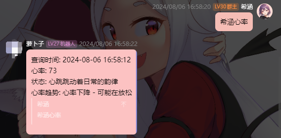
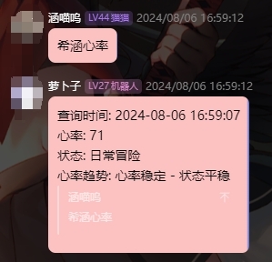

# Heart Rate Bot

## 描述

这个Spring Boot Web应用程序用于接收心率数据并提供最新的心率测量值,并使用 [Shiro](https://github.com/MisakaTAT/Shiro)
QQ机器人框架实现心率查询互动功能

要修改机器人触发关键词修改`src/cn/xihan/mibandheartratebot/Group.kt`,注解中的cmd值即可
文本同理

配合[HeartRateHook](https://github.com/xihan123/HeartRateHook)使用效果更佳

```kotlin
@MessageHandlerFilter(cmd = "查询心率")
fun fun0(
    // 机器人对象
    bot: Bot,
    // 群组消息事件
    event: GroupMessageEvent,
    // 匹配器
    matcher: Matcher
) {
    // ...
}
```

## 配置文件

1. config.json

    ```json
    {
    "heart_rate": {
        // 是否启用心率功能
        "enable": true,
        // 心率阈值
        "threshold": 10,
        // 心率状态
        "heart_rate_states": [
        {
            // 最小心率
            "minHeartRate": 30,
            // 最大心率
            "maxHeartRate": 39,
            // 状态描述
            "states": [
            "阿宅模式启动",
            "穿越梦中",
            "心跳慢如冬眠的猫"
            ]
        },
        {
            "minHeartRate": 40,
            "maxHeartRate": 52,
            "states": [
            "悠闲打盹",
            "梦开始的地方",
            "心跳轻悄悄，仿佛时间静止"
            ]
        },
        {
            "minHeartRate": 53,
            "maxHeartRate": 70,
            "states": [
            "平静日常",
            "心跳如平常的漫画翻页",
            "平静心跳，享受午后的阳光"
            ]
        },
        {
            "minHeartRate": 71,
            "maxHeartRate": 85,
            "states": [
            "日常冒险",
            "心跳跳动着日常的韵律",
            "平稳心跳，像是一本翻开的轻小说"
            ]
        },
        {
            "minHeartRate": 86,
            "maxHeartRate": 100,
            "states": [
            "小鹿乱撞",
            "心跳如小跑",
            "心跳快了一拍，可能是心动的前奏"
            ]
        },
        {
            "minHeartRate": 101,
            "maxHeartRate": 120,
            "states": [
            "萌动心跳",
            "心跳加速，如同见到了萌物",
            "心跳快了点，似乎有些许兴奋呢"
            ]
        },
        {
            "minHeartRate": 121,
            "maxHeartRate": 140,
            "states": [
            "冒险进行时",
            "心跳如寻求冒险的热血",
            "心跳加速，仿佛在经历一场大冒险"
            ]
        },
        {
            "minHeartRate": 141,
            "maxHeartRate": 200,
            "states": [
            "超次元冲刺",
            "心跳如同穿梭次元的高速列车",
            "心跳的极限挑战",
            "心跳如雷霆万钧",
            "心跳急速飙升，如狂风暴雨前的宁静",
            "心跳快得几乎要跳出胸膛，可能是遇见了未知的挑战"
            ]
        }
        ],
        // 心率趋势
        "heart_rate_trend": [
        {
            // 趋势
            "trend": "上升",
            // 描述
            "descriptions": [
            "心率上升 - 可能在运动",
            "心跳加快 - 可能在紧张",
            "心率增加 - 可能在兴奋"
            ]
        },
        {
            "trend": "下降",
            "descriptions": [
            "心率下降 - 可能在放松",
            "心跳减缓 - 可能在休息",
            "心率减少 - 可能在恢复"
            ]
        },
        {
            "trend": "稳定",
            "descriptions": [
            "心率稳定 - 状态平稳",
            "心跳平稳 - 没有明显变化",
            "心率保持不变 - 状态正常"
            ]
        }
        ]
    },
    //允许使用的QQ群号
    "groups": [
        123456789
    ]
    }
    ```

2. src/main/resources/application.yml

   修改参考[Shiro](https://misakatat.github.io/shiro-docs/#%E8%BF%9E%E6%8E%A5%E9%85%8D%E7%BD%AE)的配置文件

    ```yaml
    # 该配置为正向连接示例
    shiro:
    ws:
      client:
      enable: true
      url: "ws://websocket_server:port"
    ```

## 功能

* 接收心率数据：通过POST请求接收心率数据
* 获取最新心率：通过GET请求提供最新的心率测量值
* 静态文件：提供静态HTML文件,以供直播使用

---

## 端点

GET /latest-heart-rate

* 描述：获取最新的心率测量值
* 响应：包含最新心率和时间戳的JSON对象

POST /receive_data

* 描述：接收心率数据
* 请求体：包含心率和时间戳的JSON对象
* 响应：确认消息

GET /

* 描述：根端点，用于检查服务器是否正在运行
* 响应：确认消息

GET /html/index.html

* 描述：提供静态HTML文件
* 响应：静态HTML文件

---

## 如何运行

1. 配置OneBot机器人,将src/main/resources/application.yml中的onebot.host配置为OneBot的地址

2. 编译Jar:

    ```shell
    gradle bootJar
    ```

3. 运行服务器:

    ```shell
    java -jar build/libs/miband-heart-rate-bot-0.1.0.jar
    ```

4. 访问应用程序: http://localhost:8000

## Docker

1. 配置OneBot机器人,将src/main/resources/application.yml中的onebot.host配置为OneBot的地址

2. 构建Docker镜像:

    ```shell
    docker build -t heart-rate-bot .
    ```

3. 运行Docker容器:

    ```shell
    docker run -p 8000:8000 heart-rate-bot
    ```

4. 访问应用程序: http://localhost:8000

---

## 示例请求

POST /receive_data

```shell
curl -X POST "http://localhost:8000/receive_data" -H "Content-Type: application/json" -d '{"data": {"heart_rate": 75}, "measured_at": 1723008188241}'
```

GET /latest-heart-rate

```shell
curl -X GET "http://localhost:8000/latest-heart-rate"
```

## 静态文件

静态HTML文件放在 static 目录中,它们将在 /html 提供

---

# 截图

完成后可以在自己的服务器上查看心率数据，使用机器人根据心率数据做出相应回复

养电子宠物,品赛博人生

[完整效果预览视频](https://www.bilibili.com/video/BV1YuaQe6EbF/)

以下截图是配合[HeartRateHook](https://github.com/xihan123/HeartRateHook)结果,并非单纯本项目就能完成


