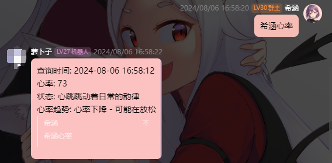
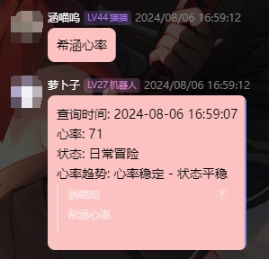

# Heart Rate Bot

## 描述

这个Spring Boot Web应用程序用于接收心率数据并提供最新的心率测量值,并使用 [Shiro](https://github.com/MisakaTAT/Shiro)
QQ机器人框架实现心率查询互动功能

要修改机器人触发关键词修改`src/cn/xihan/mibandheartratebot/Group.kt`,注解中的cmd值即可
文本同理

配合[HeartRateHook](https://github.com/xihan123/HeartRateHook)使用效果更佳

```kotlin
@MessageHandlerFilter(cmd = "查询心率")
fun fun0(
    // 机器人对象
    bot: Bot,
    // 群组消息事件
    event: GroupMessageEvent,
    // 匹配器
    matcher: Matcher
) {
    // ...
}
```

## 配置文件

1. application.yml

   修改参考[Shiro](https://misakatat.github.io/shiro-docs/#%E8%BF%9E%E6%8E%A5%E9%85%8D%E7%BD%AE)的配置文件

    ```yaml
    # 该配置为正向连接示例
    shiro:
    ws:
      client:
      enable: true
      url: "ws://websocket_server:port"
    ```

   心率区间描述配置

    ```yaml
    - minHeartRate: 30 # 最小心率
      maxHeartRate: 39 # 最大心率
      descriptions: # 描述
        - "阿宅模式启动"
        - "穿越梦中"
        - "心跳慢如冬眠的猫"

    ```

   心率趋势描述配置

    ```yaml
    - trend: "上升" # 心率趋势 不可改
      descriptions: # 描述
        - "心率上升 - 可能在运动"
        - "心跳加快 - 可能在紧张"
        - "心率增加 - 可能在兴奋"

    ```

## 功能

* 接收心率数据：通过POST请求接收心率数据
* 获取最新心率：通过GET请求提供最新的心率测量值
* 静态文件：提供静态HTML文件,以供直播使用

---

## 端点

GET /latest-heart-rate

* 描述：获取最新的心率测量值
* 响应：包含最新心率和时间戳的JSON对象

POST /receive_data

* 描述：接收心率数据
* 请求体：包含心率和时间戳的JSON对象
* 响应：确认消息

GET /

* 描述：根端点，用于检查服务器是否正在运行
* 响应：确认消息

GET /html/index.html

* 描述：提供静态HTML文件
* 响应：静态HTML文件

---

## 如何运行

1. 修改配置文件

2. 编译Jar:

    ```shell
    gradle bootJar
    ```

3. 运行服务器(.jar要和application.yml同目录):

    ```shell
    java -jar build/libs/miband-heart-rate-bot-0.1.0.jar
    ```

4. 访问应用程序: http://localhost:8000

## 示例请求

POST /receive_data

```shell
curl -X POST "http://localhost:8000/receive_data" -H "Content-Type: application/json" -d '{"data": {"heart_rate": 75}, "measured_at": 1723008188241}'
```

GET /latest-heart-rate

```shell
curl -X GET "http://localhost:8000/latest-heart-rate"
```

## 静态文件

静态HTML文件放在 static 目录中,它们将在 /html 提供

---

# 截图

完成后可以在自己的服务器上查看心率数据，使用机器人根据心率数据做出相应回复

养电子宠物,品赛博人生

[完整效果预览视频](https://www.bilibili.com/video/BV1YuaQe6EbF/)

以下截图是配合[HeartRateHook](https://github.com/xihan123/HeartRateHook)结果,并非单纯本项目就能完成


